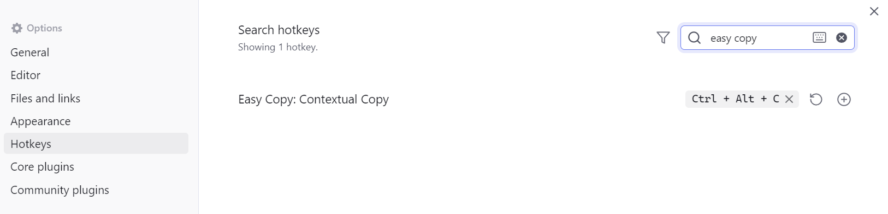

# Easy Copy - 让复制变得简单又智能！
[English](./README.md) | 中文文档

   

Easy Copy 可以根据你的光标位置智能复制文本（例如 `内联代码` 内的文本），
同时，它也支持快速生成并复制跳转到 **标题** 或者 **段落（块）** 的笔记内部链接。

## ✨ 功能特色

- 🚀 **轻松上手** - 你只需要一个命令就可以完成各种复制操作
- 🧙‍♂️ **智能识别** - 根据光标位置自动识别并复制不同类型的文本内容
- 🔍 **多种格式** - 一键复制行内代码、加粗文本、高亮文本、斜体文本、标题链接和块链接
- 📝 **自动生成** - 自动生成标题链接，或是为当前段落生成一个新的块 ID 并复制块链接
- 🌐 **多语言支持** - 完整支持英文、简体中文和繁体中文

## 🤔 为什么使用这个插件

### 📝 复制不带格式的内部文本！

我经常用 `行内代码` 来写一些调试指令或关键字，并且需要快速地复制 `` ` `` 符号内部的内容。
在过去，我需要小心地选中包裹住的文本然后才能复制……这太麻烦了！
**我想直接复制行内代码内部的文本**  
于是我写了这个插件，只需要将光标置于行内代码里头，按下快捷键，就可以一键快速复制！

就像这样：

> 它也支持复制加粗文本、高亮文本、斜体文本……内的文本。
> （如果你不需要这些，可以在设置中关闭它们）

> [!IMPORTANT]
> 由于 OB 插件规范的限制，默认没有分配快捷键，  
> **你需要在 Obsidian 的快捷键设置中为“Easy Copy: 智能复制”命令分配快捷键。**  
> 我个人比较推荐使用 <kbd>Ctrl+Alt+C</kbd>。

### 🎩 一键复制简洁的标题链接！
更加惊喜的是，如果你将光标放置在标题行，按下同一个“智能复制”快捷键，就可以复制出指向这个标题的内部链接！

> [!TIP]
> 你可以在插件设置中选择 markdown 链接格式（``）或是 wiki 链接格式（`[[]]`）

不仅如此，它将使用标题文本作为显示文本，有效减少链接的长度。

从 `[[笔记名称#标题文本]]` 到 `[[笔记名称#标题文本|标题文本]]`，文本内容长了，但是视觉效果短了！

前后对比：

### 🧱 一键生成块链接！且支持自定义块ID

如果当前文本存在现成的块链接，那么和标题一样，插件会复制指向这个块的链接。

在 1.2.0 版本后，插件还支持给当前文本**自动生成块链接**（需要在设置中启用 `自动生成块ID` 选项）：  
当你的光标所在位置没有任何内容可以复制的时候，会自动为当前段落生成一个随机的块 ID，并将链接复制进剪贴板。

而且，复制出来的链接将会使用文本的摘要作为显示文本，不需要面对 Block ID 那让人困扰的随机字符了！

> 如果你想的话，也可以在设置中启用「手动输入块ID」（只支持字母、数字、短横线 `-` 和下划线 `_` ）

## 🪄 如何使用

1. 基础用法：将光标置于需要复制的位置，使用插件提供的 `智能复制` 命令进行复制
2. 你也可以分配快捷键，按下快捷键即可一键复制。 
3. 插件也提供了右键菜单操作 [menu-item](assets/menu-item.png)

## 🔧 设置选项

### 常规

- **添加到菜单** - 将命令添加到右键菜单中
- **显示通知** - 复制内容时显示通知提示
- **使用标题作为显示文本** - 在链接中使用标题文本作为显示文本

### 格式

- **链接格式** - 复制标题链接时使用的格式（Markdown链接或Wiki链接）
  - Markdown链接: `(显示文本)[链接]`
  - Wiki链接: `[[链接|显示文本]]`

### 块ID

- **自动生成块ID** - 启用后，当你的光标所在位置没有任何内容可以复制的时候，会自动为当前段落生成一个随机的块 ID，并将链接复制进剪贴板。
- **手动输入块ID** - 启用后，可以手动输入新的块ID（这种情况下，生成的显示文本会直接使用你输入的文本）

### 复制对象

- **自定义复制对象** - 启用后可以自定义哪些元素可以被复制，你可以排除特定的类型（比如加粗或者斜体文本），避免复制它们。

## 🛠️ 安装方法

目前插件已经上架插件商城，搜索 Easy Copy 即可安装。

（另外也可以用 [BRAT](https://github.com/TfTHacker/obsidian42-brat) 插件进行安装）

## 🤝 贡献

欢迎提交问题和功能请求！如果你想为这个项目做出贡献，请随时提交PR。

这个插件在日常编辑中属实带给我很大的体验提升，所以也希望它能对你有所帮助！ 🌟

