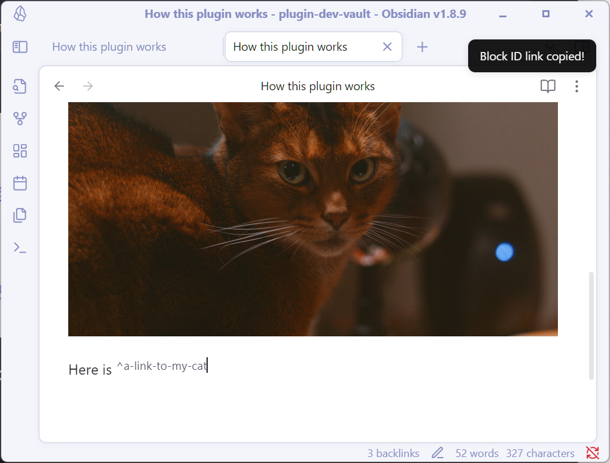

# Easy Copy - 让复制变得简单又智能！
[English](./README.md) | 中文文档


## ✨ 功能特色

- 🧙‍♂️ **智能识别** - 根据光标位置自动识别并复制不同类型的内容
- 🔍 **多种格式支持** - 复制行内代码、加粗文本、高亮文本、斜体文本、块ID和标题链接
- 🌐 **多语言支持** - 完整支持英文、简体中文和繁体中文
- 🎛️ **高度自定义** - 可选择启用或禁用特定类型的复制功能


## 🤔 为什么使用这个插件

### 行内代码——只要中间的文本！
我经常用 `行内代码` 来写一些调试指令或关键字，并且需要快速地复制 `` ` `` 符号内部的内容。
在过去，我需要小心地选中包裹住的文本然后才能复制……这太麻烦了！
**我想直接复制行内代码中的文本**
于是我写了这个插件，只需要将光标置于行内代码的内部，就可以一键快速复制！

就像这样：


> 它同时也支持复制加粗文本、高亮文本、斜体文本。
> （如果你不需要这些功能，可以在设置中关闭它们）


### 标题链接——只显示标题文本！
至于标题链接，是另一个苦恼已久的问题。
默认的标题链接会显示为很长的一段文本，我希望能**只显示标题的文本**——也就是将它作为显示文本！
所以我在这个插件中同样添加了这个功能：


```md
从：
[[笔记名称#标题文本]]

到：
[[笔记名称#标题文本|标题文本]]
```

它们的差异看起来像是这样：


### 块链接——就是块链接！
这与标题链接几乎一样，所以我也实现了它！




## 🪄 如何使用

1. 最简单的方法是使用默认快捷键 `Ctrl+Alt+C`（你可以自定义），只需将光标放在特定文本内部，按下快捷键即可复制。
2. 插件也支持右键菜单操作（如果不需要，可以在设置中关闭）
3. 当然，你也可以在命令面板中搜索"智能复制"来触发——与快捷键效果相同！


## 🔧 设置选项

### 常规设置

- **添加到菜单** - 将命令添加到右键菜单中
- **显示通知** - 复制内容时显示通知提示
- **使用标题作为显示文本** - 在链接中使用标题文本作为显示文本

### 格式设置

- **链接格式** - 复制标题链接时使用的格式（Markdown链接或Wiki链接）
  - Markdown链接: `(文本)[链接]`
  - Wiki链接: `[[链接|文本]]`


### 复制对象设置

- **自定义复制对象** - 启用后可以自定义哪些元素可以被复制
  - **启用行内代码** - 启用复制行内代码，如 `代码示例`
  - **启用加粗文本** - 启用复制加粗文本，如 **加粗示例**
  - **启用高亮文本** - 启用复制高亮文本，如 ==高亮示例==
  - **启用斜体文本** - 启用复制斜体文本，如 *斜体示例*


## 🛠️ 安装方法

目前插件还没上架官方商店，需要先用 [BRAT](https://github.com/TfTHacker/obsidian42-brat) 插件进行安装。

等上架之后我会更新这里！


## 🤝 贡献

欢迎提交问题和功能请求！如果你想为这个项目做出贡献，请随时提交PR。


## 📄 许可证

[MIT](LICENSE)
