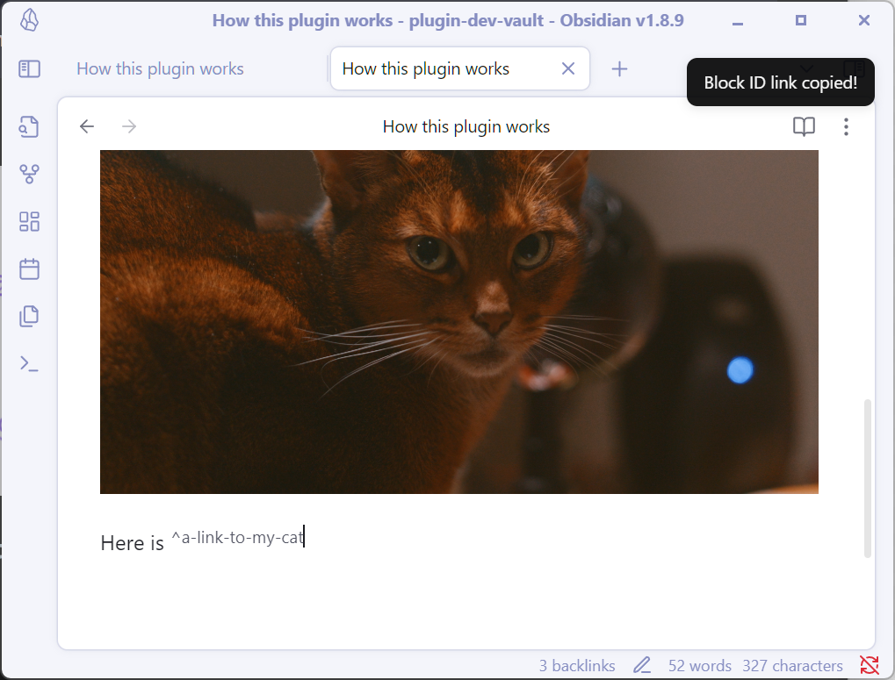

# Easy Copy - Make Copying Smart and Simple!

English | [中文文档](./README-zh.md)


## ✨ Features

- 🧙‍♂️ **Smart Detection** - Automatically identifies and copies different types of content based on cursor position
- 🔍 **Multiple Format Support** - Copy inline code, bold text, highlighted text, italic text, block IDs, and heading links
- 🌐 **Multilingual Support** - Full support for English, Simplified Chinese, and Traditional Chinese
- 🎛️ **Highly Customizable** - Enable or disable specific copy features as needed


## 🤔 Why use this plugin

### Inline Code — Just the Text Inside!
I often use `inline code` for debug commands or keywords and need to quickly copy the content inside the `` ` `` symbols.
In the past, I had to carefully select the text wrapped inside... which was quite tedious!
**I want to directly copy the text inside the inline code**
So I created this plugin - just place your cursor inside the inline code, and copy with a single keystroke!

Just like this:


> It also supports copying bold text, highlighted text, italic text.
> (If you don't need these features, you can disable them in the settings)


### Heading Links — Copy a more concise link to the heading
As for heading links, that's another long-standing issue.
Default heading links display as a long text string, but I wanted to **show only the heading text** — using it as the Display Text!
So I added this feature to the plugin as well:


It would copy the heading text as the display text:

```md
From:
[[note-name#heading-text]]

To:
[[note-name#heading-text|heading-text]]
```

The difference looks like this:


### Block Links — Auto generating block ID
This works almost the same as heading links, so I implemented it too!



After version 1.2.0, this plugin also supports automatically generating a block ID for the current text (requires enabling the "Auto-add Block ID" option in settings):
When your cursor is in a position with no content to copy, it will automatically generate a random block ID for the current paragraph and copy the link to the clipboard.


>  It also supports manually inputting a custom block ID!


## 🪄 How to Use

1. The simplest way is to use a keyboard shortcut (I use `Ctrl+Alt+C`, you can customize it in settings) — just place your cursor inside the specific text and press the hotkey to copy. 
2. The plugin also supports right-click menu operations (which can be disabled in settings if not needed)

3. Of course, you can also trigger it by searching for "Contextual Copy" in the command palette — it works the same as the hotkey!


## 🔧 Settings

### General Settings

- **Add to Menu** - Add the command to the context menu
- **Show Notice** - Display a notification when content is copied
- **Use Heading as Display Text** - Use the heading text as display text in links

### Format Settings

- **Link Format** - The format to use when copying heading links (Markdown link or Wiki link)
  - Markdown link: `(text)[link]`
  - Wiki link: `[[link|text]]`


### Copy Target Settings

- **Customize Targets** - When enabled, you can customize which elements can be copied
  - **Enable Inline Code** - Enable copying inline code, like `code example`
  - **Enable Bold Text** - Enable copying bold text, like **bold example**
  - **Enable Highlighted Text** - Enable copying highlighted text, like ==highlight example==
  - **Enable Italic Text** - Enable copying italic text, like *italic example*


## 🛠️ Installation

Currently, the plugin is not yet available in the official store. You'll need to install it using the [BRAT](https://github.com/TfTHacker/obsidian42-brat) plugin.

I'll update this section once it's available in the official store!


## 🤝 Contribution

Issues and feature requests are welcome! If you'd like to contribute to this project, feel free to submit a PR.

This plugin really improved my workflow, and I hope it can help you too! 🌟
