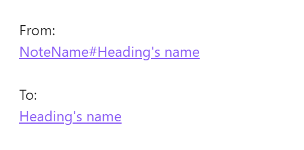
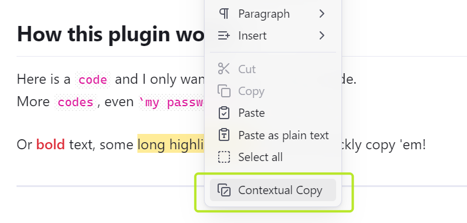

# Easy Copy - Make Copying Smart and Simple!

English | [中文文档](./README-zh.md)

Easy Copy can smartly copy content based on your cursor position (e.g. code text inside `inline code`, without formatting symbols).  
Besides, it also supports quickly generating and copying links to **headings** or **paragraphs(blocks)** in your notes.

## ✨ Features

- 🚀 **Easy to Use** - You only need one command to complete various copy operations
- 🧙‍♂️ **Smart Detection** - Automatically identifies and copies different types of content based on cursor position
- 🔍 **Multiple Format Support** - Copy inline code, bold text, highlighted text, italic text, block linkss, and heading links
- 📝 **Auto Generate** - Automatically generate heading links, or generate a new block ID for the current paragraph and copy the block link
- 🌐 **Multilingual Support** - Full support for English, Simplified Chinese, and Traditional Chinese

## 🤔 Why use this plugin

### 📝 Copy the text inside Inline Code

I often use `inline code` for debug commands or keywords and need to quickly copy the content inside the `` ` `` symbols.
In the past, I had to carefully select the text wrapped inside... which was quite tedious!
**I want to directly copy the text inside the inline code**  
So I created this plugin - just place your cursor inside the inline code, and copy with a single keystroke!

Just like this:

> It also supports copying bold text, highlighted text, italic text.
> (If you don't need these features, you can disable them in the settings)

> [!IMPORTANT]
> Due to the limitations of Obsidian plugins, the default does not assign a shortcut key,  
> **you need to assign a shortcut key in Obsidian's keyboard settings for the "Easy Copy: Contextual Copy" command.**  
> I personally recommend using <kbd>Ctrl+Alt+C</kbd>. 

### 🎩 Copy (concise) Heading Links
Even more surprisingly, if you place the cursor on the heading line and press the same "Contextual Copy" shortcut key, you can copy the internal link pointing to the heading!

> [!TIP]
> You can choose between markdown link format (``) and wiki link format (`[[]]`) in the plugin settings.

Not only that, it will use the heading text as the display text, effectively reducing the length of the link.

From `[[Note Name#Heading Text]]` to `[[Note Name#Heading Text|Heading Text]]`, the text content is longer, but the visual effect is shorter!

The difference looks like this:

### 🧱 One-click Block Link Generation

If the current text contains an existing block link, the plugin will copy the link pointing to this block, just like it does with the title.

After version 1.2.0, the plugin also supports **automatically generating block links** for the current text (you need to enable the `Auto generate block ID` option in the settings):

When there is no content at the cursor position to copy, it will automatically generate a random block ID for the current paragraph and copy the link to the clipboard.  
Moreover, the copied link will use the text's summary as the display text, so you won't have to deal with the confusing random characters of the Block ID!

> If you prefer, you can also enable "Manually enter Block ID" in the settings (only letters, numbers, hyphens (`-`) and underscores (`_`) are supported).

## 🪄 How to Use

1. Basic Usage: Place the cursor at the position you want to copy, and use the `Contextual Copy` command to copy.
2. You can also assign a hotkey, and press it to copy with one click. 
3. The plugin also provides a right-click menu operation 

## 🔧 Settings

### General

- **Add to Menu** - Add the command to the right-click menu.
- **Show Notifications** - Show a notification when content is copied.
- **Use Title as Display Text** - Use the title text as the display text in the link.

### Format

- **Link Format** - The format used when copying title links (Markdown link or Wiki link).
  - Markdown link: `(Display Text)[Link]`
  - Wiki link: `[[Link|Display Text]]`

### Block ID

- **Auto-generate Block ID** - When enabled, if there is no content at the cursor position to copy, it will automatically generate a random block ID for the current paragraph and copy the link to the clipboard.
- **Manually enter Block ID** - When enabled, you can manually enter a new block ID (in this case, the display text will directly use the text you entered)

### Copy Target

- **Custom Copy Target** - When enabled, you can customize which elements can be copied, allowing you to exclude specific types (such as bold or italic text) to avoid copying them.

## 🛠️ Installation

The plugin is now available in the community plugins list, you can search for "Easy Copy" to install it.

(Alternatively, you can also use the [BRAT](https://github.com/TfTHacker/obsidian42-brat) plugin to install it)

## 🤝 Contribution

Issues and feature requests are welcome! If you'd like to contribute to this project, feel free to submit a PR.

This plugin really improved my workflow, and I hope it can help you too! 🌟
